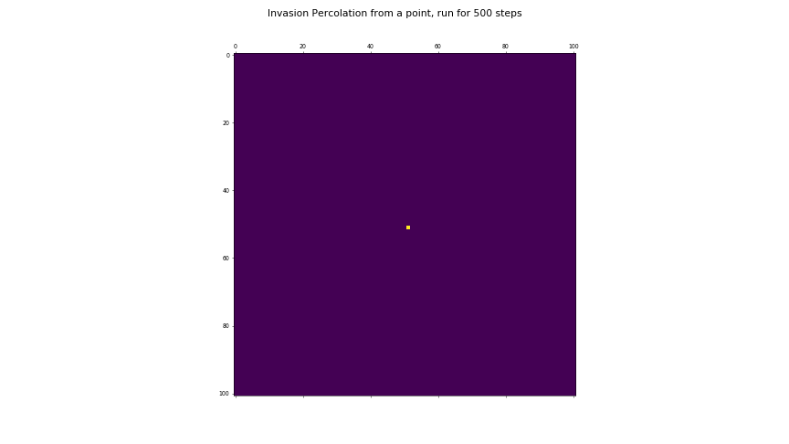

Percolation
===========

This repository is a small collection of code to model the statistical phenomenon of percolation, and to possibly visualise the appearance of the infinite percolating cluster, and the corresponding threshold probability.

Site percolation is considered, on a 2 dimensional, square lattice.

**Dependencies**: python3, numpy, and matplotlib

The notation used in the program is as follows:

 * **SIZE** : The number of sites along a length of the square lattice. So the total number of sites will be **SIZE**2.
 * **P** : The occupation probability of a site.
 * **PEAS** : The number of probability values to scan through.

All the files are independent programs, and may be run using python 3. The different programs generate slightly different visualisations of percolation:

 * `percolation`: A single image of percolation at some **P**.
 * `series`     : A slide-show of lattices across a range of **P** values.
 * `interactive`: Like `series`, but with a slider.
 * `clusters`   : Identifying the infinite cluster, and also other finite ones.
 * `invasion`   : Emergence of pc from a wetting process

The `clusters` program is incomplete, and is a WORK-IN-PROGRESS.

